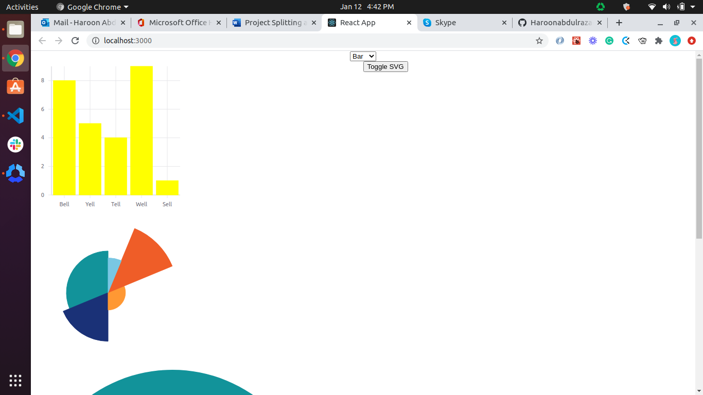
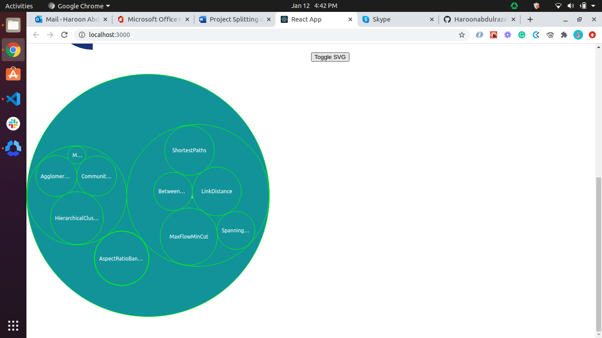

# My-Vis-App :arrow_upper_right:
This is a test code for the graphing API
 
## Screenshots :camera: 

### Setting up 🔧
 To clone this repo
 - [ ] Run this command in your terminal/ gitbash
      <code> git clone https://github.com/Haroonabdulrazaq/my-vis-app.git</code>
 - [ ] Change directory into the repository you just cloned
      <code> cd my-vis-app </code>
 - [ ] To install all dependencies for the project, run
      <code> npm install </code>
 - [ ] To get the project started in your browser, run
      <code> npm start </code>

## Author

👤 **Haroon Abdulrazaq**

- Github: [@githubhandle](https://github.com/Haroonabdulrazaq)
- Twitter: [@twitterhandle](https://twitter.com/hanq_o)
- Linkedin: [linkedin](https://www.linkedin.com/in/haroonabdulrazaq)

## Show your support

Give a ⭐️ if you like this project!

## Acknowledgments

- I acknowledge Microverse, the global remote school for developers.
- I appreciate The Odin Project for providing the project and making lessons simple to learn.
- I appreciate Cindy Shin for providing me with the design

## 📝 License

This project is [MIT](lic.url) licensed.